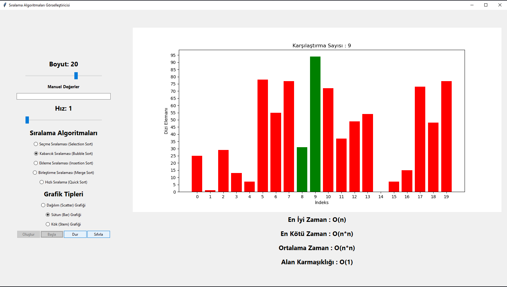

# Proje Özeti

Bu proje, kullanıcının sıralama algoritmalarını ve grafik türlerini kullanarak bir listenin sıralanmasını ve sıralama işleminin adımlarını görsel bir şekilde görmesini sağlayan bir arayüz sunar. Kullanıcılar sıralanacak listeyi manuel olarak girebilir veya bir boyut belirterek rastgele bir liste oluşturabilirler. Ayrıca, kullanıcılar arayüz üzerinde hız, sıralama algoritmaları ve grafik türleri gibi özellikleri özelleştirebilirler.

# Geliştirme Ortamı

Bu proje, Python 3.8.16 sürümü kullanılarak geliştirilmiştir. Arayüz oluşturmak için tkinter kütüphanesi kullanılmıştır ve grafik gösterimleri için matplotlib kütüphanesi kullanılmıştır. Geliştirme işlemleri, Visual Studio Code gibi bir kod editörü kullanılarak gerçekleştirilmiştir. Proje geliştirme sürecinde, GitHub gibi bir kod paylaşım platformu kullanılmıştır.

# Projeyi Yükleme ve Çalıştırma

1. Projeyi GitHub'dan indirin veya klonlayın.
2. Projeyi açın ve terminale gidin.
3. Gerekli kütüphaneleri ```pip install <kütüphane>``` ile yükleyin.
4. Projenin bulunduğu dizinde, terminalde şu komutu çalıştırın: ```python main.py```
5. Uygulamayı kullanmaya başlayabilirsiniz.

# Görsel Arayüz

**Uygulama** 




